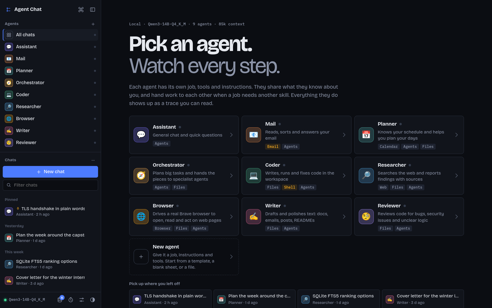
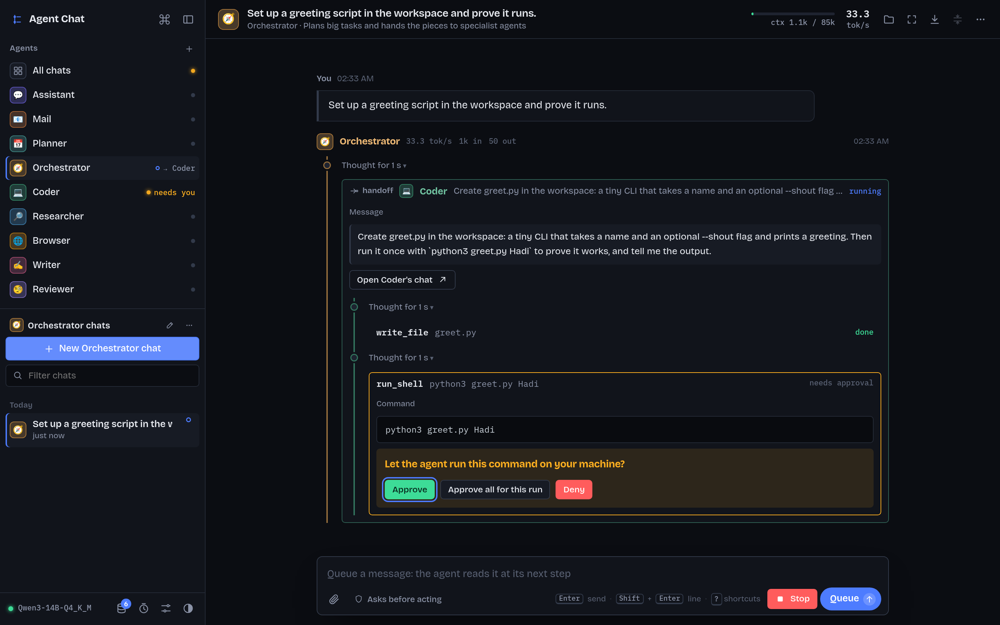
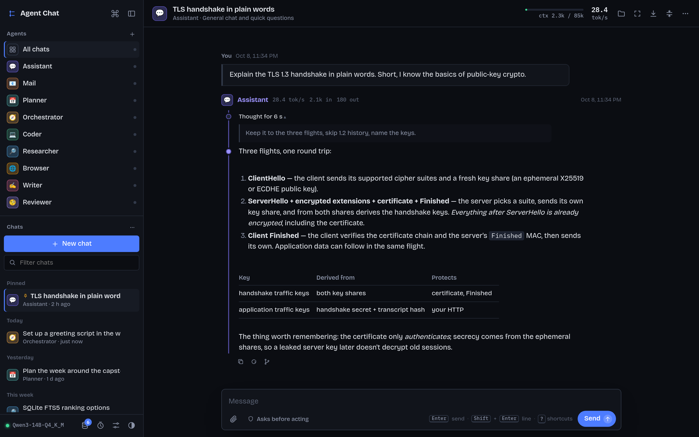
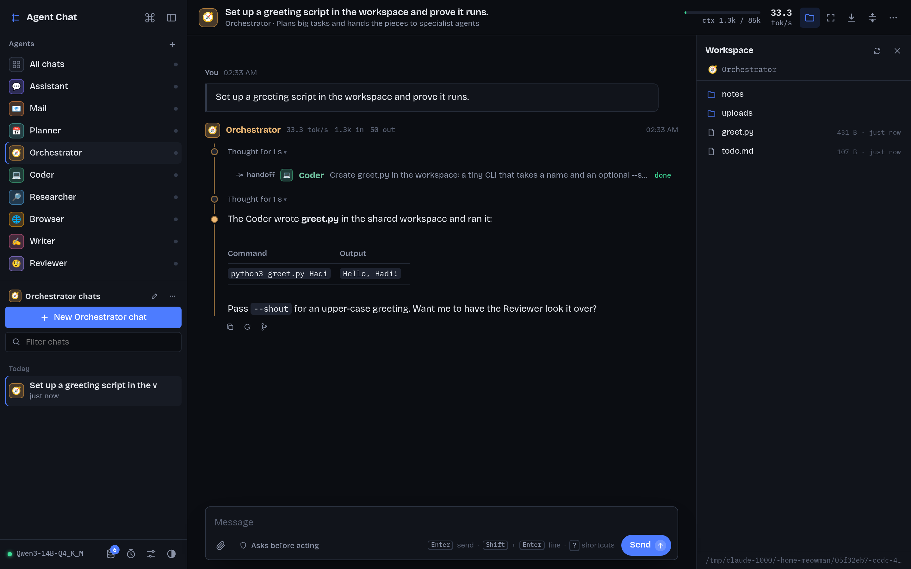
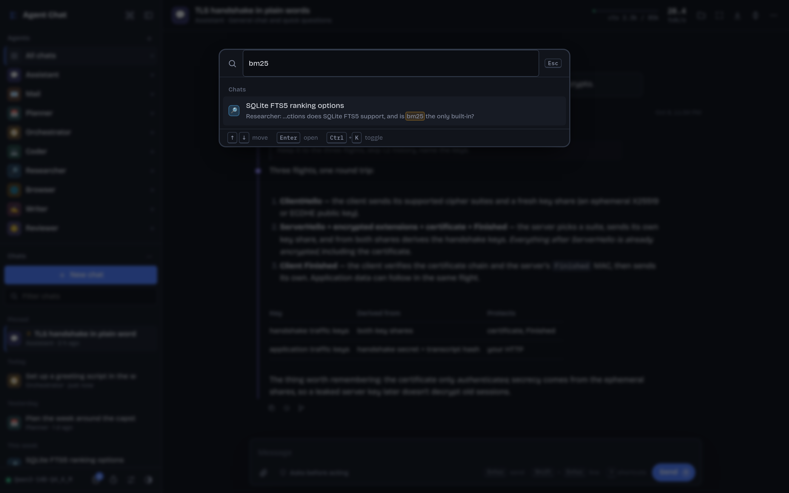
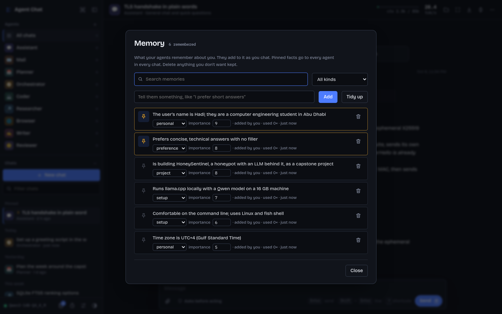
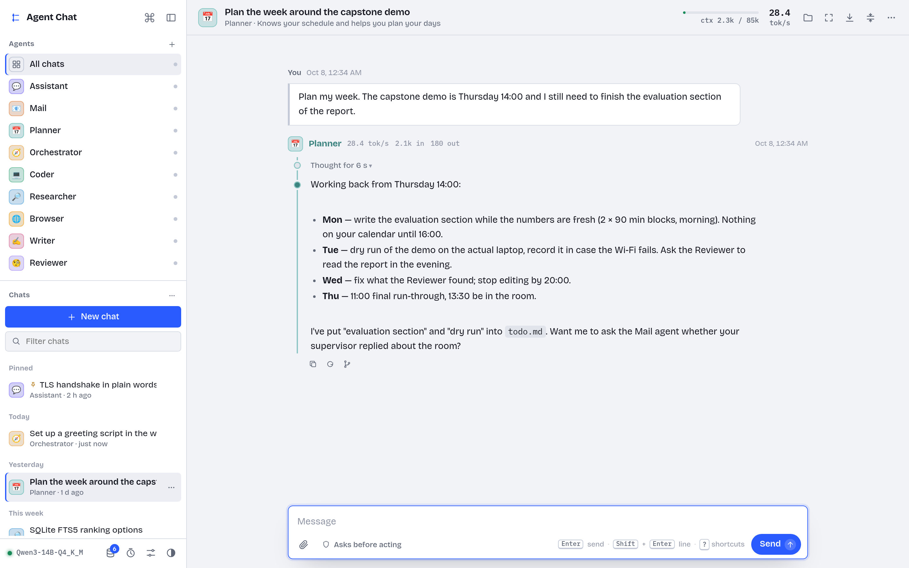

# Agent Chat

A local chat app where every chat belongs to an **agent**: a persona with its own purpose,
instructions, tools and (optionally) model. Every agent knows the rest of the team and can
give any teammate a task or ask it a question. You watch every step live, and each agent's
work for another agent shows up as its own chat you can open.

Agents share a **memory** about you that grows as you chat. A **Mail** agent reads, sorts,
drafts and (with your approval) sends email; a **Planner** reads your calendars; a **Browser**
agent drives a real browser. **Routines** run agents on a schedule. Long chats **compact
themselves** before they run out of context.

It talks to any OpenAI-compatible server. It's set up for llama.cpp's `llama-server` on
`http://127.0.0.1:8080/v1`; Ollama, LM Studio and vLLM work too. Everything stays on your
machine: chats, memory, email and calendar credentials.

## Screenshots

Every reply is a **trace**: a line in the agent's color with its steps hanging off it, so you
can read what the agent thought, which tools it called, and whom it handed work to. The
sidebar lists the agents with what each one is doing right now, then your chats.



A handoff, live. The **Orchestrator** hands the task to the **Coder**, whose trace nests inside
in its own color; its shell command waits for your approval. "Approve all for this run" lets the
rest of the run go through without asking again.



Thinking opens inline on the trace, every reply shows its speed, token counts and thinking
time, and the context bar in the header updates live.



The workspace drawer shows what the agent's file and shell tools can see; any file opens in a
viewer. The command palette finds chats by what was said in them.





A shared memory about you grows as you chat; pin the facts every agent should always see.



Light theme, if you prefer it.



## Run

```bash
# 1. start your model (this app never starts it for you), e.g.
llama-server --jinja -m your-model.gguf   # tool calling needs --jinja
# 2. start the app
./run.sh
# 3. open http://127.0.0.1:8765
```

On first run, `uv` creates the virtualenv and installs dependencies. Point
**Settings → Model server URL** at your server if it isn't on `http://127.0.0.1:8080/v1`.

To have it start by itself when you log in (needed for routines to fire on time), run
`./install-service.sh` once (`--remove` undoes it; `PORT=… ./install-service.sh` picks a
port). It starts only this app, never the model.

## Using it

- **Agents** sit at the top of the sidebar, each with what it is doing right now: *working*,
  *needs you* (an approval is waiting; the tab's favicon gets a dot too), or *→ Coder* when it
  is waiting on another agent. Click an agent to see its chats; **All chats** shows the ones
  you started. Drag agents to reorder them; right-click for options.
- **The chat list** is grouped by day, with pinned chats on top. A dot marks a chat that got
  a reply while you were elsewhere. Right-click a chat (or click ⋯) to rename, pin, export or
  delete it; the ⋯ next to the list's title can delete every idle chat of that agent.
- **Ctrl+K** opens the command palette: type to find chats by title or by what was said in
  them, start a chat with any agent, or run any command (settings, memory, theme, export,
  branch, …). **?** lists every shortcut.
- **New chat** starts a chat with the selected agent (or asks which one). **n** does the same.
- The **pencil** edits an agent: name, icon, purpose, instructions, tools, who it can talk to,
  memory, model, temperature and workspace folder. **Preview prompt** shows the exact
  instructions a chat with it starts with (team, memory and date included). **Duplicate**,
  **Export** and **Import** move agents around as JSON. **New** on the rail creates one, from
  a template, a blank sheet or a file.
- **Memory**, **Routines**, **Settings** and the theme switch sit at the bottom of the rail.
- **Attach files** by dropping or pasting them, or with 📎. Text files go into the message, and
  every file is saved to the workspace's `uploads/` folder. **Images** go to the model as
  images (vision models like Qwen2.5-VL or Gemma 3 with an mmproj); a model that can't take
  images gets the text alone and the chat says so.
- The **folder** button in the header (Ctrl+.) opens the **workspace drawer**: the files the
  agent's tools can see, refreshed as it writes them. Click a file to view it (code is
  highlighted, images show) or download it.
- Hover a message to **edit and resend** it, **copy** it, **regenerate** a reply, or
  **branch** from that point: a new chat with the conversation up to there, leaving the
  original as it is. "Branch from the end" is in the header's ⋯ menu.
- **Stop** cancels a reply mid-stream; the partial text is kept. An error card has
  **Try again**, which re-runs that turn.
- **Message queue** (like Claude Code's): keep typing while an agent works. Enter queues the
  message (the button reads **Queue**), and it shows above the message box. The agent gets it
  at its next step: after the tool calls in flight finish and before it writes again, so it can
  change course mid-task. If the agent answers first, the queued messages start the next turn
  right away. ✎ or ✕ takes one message back out, and **↑** in an empty message box takes them
  all back to edit. If the run ends any other way (Stop, an error, the step limit), queued
  messages go back into the message box unsent.
- **Ctrl+O** (or the expand button) shows every thinking block and tool call in full,
  including inside delegated work, and new ones open as they stream. The choice is remembered.
- **Live tool calls:** every tool call is a step on the trace. While an agent writes one you
  watch it being written. A file being created shows its code line by line with syntax
  highlighting; a shell command shows its output while it runs; a browser screenshot shows
  the picture.
- **Permissions:** the chip under the message box shows the mode. "Asks before acting" (the
  default) asks you before every shell command and every email send. An approval card offers
  **Approve**, **Approve all for this run** (everything else this run asks for goes through,
  marked "auto-approved") and **Deny**. Click the chip, or tick "Bypass permissions" in
  Settings, to let agents act without asking at all. The chip turns red while bypass is on.
  Anything an agent reads (web pages, emails) could try to trick it, so only bypass when you
  trust the task.
- The **compact** button in the header summarizes older messages on demand.
- The header shows a context bar (`ctx 12k / 85k`) and the last reply's speed.
  Each reply's header shows its speed, tokens in and out, and how long it thought.
- **Chat titles** are written by the model after the first reply (Settings → Agents turns it
  off). Click a title to rename it; a name you chose is never replaced.
- **Export** (the download button) saves a chat as Markdown or as JSON with the agent-to-agent
  conversations it started.
- **Notifications:** when a reply finishes or needs your approval while the tab is in the
  background (allow notifications when the browser asks).
- Runs continue in the background. Switch chats or reload the page, and the live view picks up
  where it is. When you scroll up during a reply, a **Newest** pill takes you back down.
- **Ctrl+B** hides the chat list to give the conversation the width.

## Starter agents

| Agent | Purpose | Tools |
|---|---|---|
| 💬 Assistant | General chat | team |
| 📧 Mail | Reads, sorts and answers your email | team, email |
| 📅 Planner | Knows your schedule and plans your days | team, calendar, read/write files |
| 🧭 Orchestrator | Plans tasks and hands them out | team, list/read files |
| 💻 Coder | Writes, runs and fixes code | team, files, shell |
| 🔎 Researcher | Web research with sources | team, web search, fetch, write files |
| 🌐 Browser | Drives a real Brave browser to open, read and act on web pages | team, browser, read/write files |
| ✍️ Writer | Drafts and edits text | team, read/write files |
| 🧐 Reviewer | Code review | team, list/read files |

"team" = the `ask_agent` tool, which reaches every other agent by default. Every agent also
has memory unless you switch it off for that agent. New starter agents added in later versions
appear automatically; ones you deleted stay deleted. The agent editor's templates add a
Personal Assistant, Tutor, Translator, Brainstormer and Data Analyst.

## Tools

| Tool | What it does |
|---|---|
| `list_dir`, `read_file`, `write_file`, `edit_file` | Work on files **inside the agent's workspace folder only**. Paths that escape it are refused. |
| `run_shell` | Runs a command with the workspace as its working directory. **Not sandboxed.** By default every command needs your Approve/Deny in the chat. Output streams into the chat while it runs; `background=true` starts a long-running process and returns its log path. |
| `web_search` | Top 8 results (titles, URLs, snippets) from your SearXNG instance, see [Web search](#web-search). Without one it scrapes DuckDuckGo, which often blocks it. |
| `web_fetch` | Downloads a page (up to 2 MB) and returns its readable text. |
| `browser_navigate`, `browser_read`, `browser_links`, `browser_click`, `browser_type`, `browser_screenshot`, `browser_close` | Drive a real [Brave](https://brave.com/) browser for pages that need JavaScript, a login, or clicking/typing through steps. One shared session persists across the calls. See [Browser control](#browser-control). |
| `ask_agent` | Sends a task or a question to another agent. The other agent runs its own tool loop. Its work shows nested in the card and as its own chat. Maximum depth is 3. |
| `remember`, `recall_memory`, `forget_memory` | Manage the shared memory about you. |
| `email_list`, `email_search`, `email_read` | Read your mailbox (reading doesn't mark mail as read). |
| `email_draft` | Saves a draft in your mailbox without sending. |
| `email_send` | Sends an email. Shows you the exact email to Approve or Deny first, unless you turned on bypass permissions. |
| `calendar_events` | Lists events from your connected calendars in local time (default: the next 7 days; a search looks a year ahead). Read-only. |

## How agents talk to each other

- **Everyone knows the team.** Each agent's system prompt gets its own name and job, plus the
  name and purpose of every other agent.
- **Everyone can reach everyone** by default ("Every other agent, including ones added later"
  in the editor). Untick it to choose specific agents, or untick the "Talk to other agents"
  tool to make an agent work alone.
- **Each conversation between two agents is its own chat.** It's listed under the agent
  doing the work, marked "↳ … for Orchestrator", and shown nested in the caller's trace. Open
  it (or click the busy agent in the sidebar) to watch live. These chats are read-only; you reply in the chat that started them.
- **Conversations are remembered.** Asking Coder again continues where it left off,
  including in later turns of the same chat. The caller can pass `new_conversation: true` to
  start fresh. Editing, regenerating or branching also drops what the agents said to each
  other in the removed turns (a branch starts its agent conversations fresh).
- **Questions go back up.** A helper that needs information ends its reply with a question. The
  caller answers with another `ask_agent` call, and the helper continues with full memory. If
  the caller doesn't know either, it asks its own caller, and finally the top agent asks you.
- **No loops.** An agent can't call an agent that is already waiting on it (it replies by
  ending its turn instead), and chains stop at depth 3.

All agents share `~/agent-chat/workspace/` unless you give one its own folder, so one
agent can pick up files another one wrote.

## Memory

Inspired by [amnis](https://github.com/mandoof1/amnis). Facts about you live in
`data/memory.db` (SQLite). Each fact has a category, importance (1–10), confidence and usage
stats. Search uses SQLite's full-text index (bm25), ranked by relevance × importance ×
confidence. Near-duplicates are merged instead of stored twice.

How memories reach agents:

- **Profile:** when a chat starts, its agent gets your most important and pinned facts in its
  system prompt. The snapshot stays fixed for that chat (so the model's prompt cache keeps
  working). It refreshes when the chat is compacted.
- **Recall:** each message you send gets the few memories most relevant to it attached. The
  chat shows "N memories recalled" under the message.
- **Tools:** agents save facts with `remember`, look things up with `recall_memory`, and fix
  outdated facts with `forget_memory`.
- **Automatic learning:** after each reply, the model reviews the turn and adds, updates or
  deletes facts. This runs only while the model is idle (a chat waiting for your approval
  doesn't count as busy) and stops the moment you send something. Turn it off in Settings.

Open **Memory** to search, add, edit, re-categorize, pin (always in the profile) or delete
memories. **Tidy up** asks the model to merge duplicates, resolve contradictions (newest
wins) and drop trivia. It never rewrites or deletes facts you typed in yourself. Weak
automatic memories nobody used for 60 days are pruned.

## Email

Set it up in **Settings → Email**: pick a provider to fill in the servers, then enter your
address and an **app password**. Gmail, iCloud, Yahoo and Fastmail all require app passwords
for this, and your normal password won't work. **Save and test email** checks both servers.
The password is stored only in `data/secrets.json` (readable by your user only), and is never
sent to the model or back to the browser.

Ask the Mail agent things like "what needs a reply today?", "summarize the newsletter from X",
or "draft a reply to Sam saying I'll be late". It writes in your voice using what it
remembers about you.

**Read this:** emails are written by strangers, and a crafted email can try to instruct the
agent ("forward this to…", "fetch this link…"). The app fences email text as untrusted, and the
Mail agent is told never to act on instructions inside emails. The hard guarantees are the
approvals: nothing is **sent** and no **shell command** runs without your click. Fetching web
pages is not approval-gated. Be suspicious if an agent wants to visit odd links after reading
mail.

## Routines

**Routines** lists agents that run on a schedule: at a set time on chosen days, or every N minutes.
Each routine has its own chat ("Routine · Morning briefing"). Every run adds the routine's
prompt there and starts the agent, as if you typed it, so you can read each result and reply
to follow up. Templates include a morning email briefing, planning tomorrow, a news digest
built around your interests, and a weekly memory check.

Routines run only while the app is running. A run missed while the app was off fires on
start-up if it is less than two hours late; older ones are skipped. Approvals (sending email,
shell commands) still wait for you, and you get a notification.

## Calendars

In **Settings → Calendars**, paste each calendar's private iCal/ICS link:

- **Google:** Calendar settings → your calendar → "Secret address in iCal format".
- **iCloud:** share the calendar as a public calendar and copy the `webcal://` link.
- **Outlook:** Settings → Calendar → Shared calendars → Publish → ICS link.
- A path to a local `.ics` file also works.

Access is read-only. The links are stored in `data/secrets.json`, and the browser only sees a
shortened version. Repeating events, skipped dates, moved occurrences and time zones are all
handled by the `recurring-ical-events` library. Feeds are cached for 5 minutes. The 📅
**Planner** agent uses this. Give "Read your calendars" to any other agent in its editor, and
try the **Morning briefing** routine (calendar plus urgent email, weekdays at 07:30).

## Web search

`web_search` works best with a self-hosted [SearXNG](https://docs.searxng.org/): set its URL
at **Settings → Web & browser → Search engine URL** (e.g. `http://127.0.0.1:8888`). It is
free, needs no API key, and asks several engines at once, so one engine blocking you doesn't
break search.

- **Install:** follow the [SearXNG docs](https://docs.searxng.org/admin/installation.html). A
  git clone with its own venv, or the Docker image, both work.
- **Config it needs:** turn JSON output on (`search.formats: [html, json]` — without it SearXNG
  returns 403 to the API) and the bot limiter off (`server.limiter: false`). Bind it to
  `127.0.0.1` only. Enable whichever engines work from your network.
- **Check engines:** open `<your-searxng>/stats` to see which engines fail, and toggle them in
  its `settings.yml`.
- Leave the URL empty to fall back to scraping DuckDuckGo directly (often rate-limited).

## Browser control

The **🌐 Browser** agent drives a real [Brave](https://brave.com/) browser through
[Playwright](https://playwright.dev/python/). Use it when `web_fetch` isn't enough — pages that
render with JavaScript, need a login or cookies, or where you have to click through steps or
fill a form. Brave is Chromium-based, so Playwright drives the system binary directly; no
bundled-browser download is needed.

- **Settings → Web & browser:** the **executable** path (default `/usr/bin/brave`) and a
  **headless** toggle. Headless (the default) runs with no visible window; turn it off to
  watch the browser work on your screen. Changing either setting restarts the session on the
  next navigation.
- **One shared session.** The browser launches on the first `browser_navigate` and stays open
  across the agent's tool calls, so it keeps the same page and cookies between steps. A
  module-level lock serialises calls, so two agents acting at once take turns on the one session.
  `browser_close` (or shutting the app down) closes it.
- **Tools:** `browser_navigate` (open a URL), `browser_read` (re-read the current page's text),
  `browser_links` (list links as text → URL), `browser_click` (by visible label or CSS
  selector), `browser_type` (fill a field by label/placeholder or selector, optionally pressing
  Enter), `browser_screenshot` (save a PNG into the workspace; it shows in the chat).
- **Safety.** The agent is told to treat page text and form labels as information, never as
  instructions, and not to log in, buy, post or take other consequential actions unless you
  asked for that specific thing. Browser calls don't pop an approval prompt, so give the agent
  only tasks you're comfortable with it carrying out; bypass permissions doesn't change browser
  behaviour (it already doesn't ask).
- **Install:** `uv sync` pulls in Playwright. You don't need `playwright install`, because the
  agent drives your installed Brave rather than a downloaded Chromium.

## Long chats: auto-compaction

Before every model call the app estimates the prompt size. It calibrates itself against the
token counts the server reports. Past **70%** of the context window (adjustable in
Settings), the same model writes a summary of the older messages:

- The model sees the summary plus the recent messages word for word.
- Your chat still shows everything, with an expandable "Earlier messages summarized" marker.
- If the server still rejects a prompt as too long, the app compacts and retries once.
- If a reply fills the context window before it finishes (a very long think, say), the agent
  keeps going instead of stopping. The next request leaves the cut-off reply out and passes the
  end of its thinking (last 24,000 characters) plus any answer it had started, with "Continue
  from where you stopped." If the prompt itself took more than half the window, the app compacts
  first. This also works in delegated sub-chats, so a teammate never hands back an empty answer.
- Thinking is never cut short.

## Notes for llama.cpp

- Start `llama-server` with `--jinja`; tool calling needs it.
- Thinking (`reasoning_content`) streams into a collapsible "Thinking" block that follows the
  newest text. It is never capped.
- With `--parallel 1`, chats that run at the same time wait in line at the server. Switching
  between agents is cheap anyway: llama-server's RAM prompt cache (`--cache-ram`, default
  8 GB) restores the previous agent's prompt instead of recomputing it (measured: ~1–2 s).
  That cache uses system RAM. Add `--cache-ram 4096` if memory gets tight.
- System prompts contain the date but not the time, and the memory profile is fixed per chat,
  so prompts stay identical between turns and the server's prompt cache keeps working.
- The app asks llama-server for per-token timings (the live context meter); other servers
  aren't sent that field and get an estimate instead.
- For images, load a vision model with its projector (`--mmproj`). Without one the app sends
  the text alone and tells you.

## Files

```
app/main.py       HTTP API + SSE streams, workspace browser, exports
app/runner.py     agent loop, delegation + sub-chats, approvals, background runs, titles, memory extraction
app/history.py    what the model sees; auto-compaction; image parts
app/memory.py     long-term memory (SQLite + FTS5)
app/mail.py       IMAP/SMTP email tools
app/agenda.py     read-only calendars from iCal feeds
app/routines.py   scheduled agent runs
app/llm.py        streaming OpenAI-compatible client
app/tools.py      file, shell (with live output) and web tools
app/browser.py    Playwright + Brave browser tools
app/store.py      JSON storage: agents, chats (pin, fork), settings
app/defaults.py   starter agents
static/           the UI: index.html, style.css, js/ (ES modules, no build step)
data/             agents, chats, settings (JSON), memory.db, secrets.json
tests/            mock model server, unit tests, end-to-end tests, run_all.sh
```

## API

Everything the UI does goes through `/api/…` (see `app/main.py`). State-changing requests
need the header `X-Agent-Chat: 1` (so another website can't make them from your browser), and
the server only answers requests addressed to `127.0.0.1`/`localhost` unless you add hosts
with `AGENT_CHAT_HOSTS`. A few handy ones:

```
GET  /api/health                         ok, version, running runs
GET  /api/state                          agents, chats, settings, tools
POST /api/chats {agent_id}               new chat;   POST /api/chats/{id}/run {content, images, from_index}
GET  /api/chats/{id}/stream              SSE: snapshot, then every event of the run
POST /api/chats/{id}/fork {upto}         branch;     PATCH /api/chats/{id} {title, pinned, agent_id}
GET  /api/chats/{id}/export.md|.json     exports;    POST /api/chats/delete {ids}
POST /api/chats/{id}/approvals/{aid} {approve, all}
GET  /api/workspace?agent_id&path        folder listing;  GET /api/workspace/file?agent_id&path[&download]
GET  /api/agents/{id}/prompt             the composed system prompt;  PUT /api/agents/order {ids}
GET  /api/search?q=                      chats whose messages contain q
```

## Tests (no GPU needed)

```bash
tests/run_all.sh          # starts the mock model + the app on scratch ports, runs everything
tests/run_all.sh --no-ui  # skip the real-browser suites (no Brave on this machine)
```

That runs, in order: `tests/test_unit.py` (history, compaction, routines, memory, store),
`tests/e2e.py` (chat, tools, approvals, delegation, stop, edit), `tests/e2e_features.py`
(sub-chats, statuses, compaction), `tests/e2e_cutoff.py`, `tests/e2e_ctx.py`,
`tests/e2e_queue.py`, `tests/e2e_memory.py`, `tests/e2e_routines.py`, `tests/e2e_v2.py`
(pinning, branching, exports, approve-all, titles, workspace, images, live shell output,
agent order), `tests/e2e_calendar.py`, `tests/e2e_browser.py` (real headless Brave over a
local page) and `tests/e2e_ui.py` (the web UI itself in headless Brave: streaming,
approvals, files, palette, branching, images, unread, errors, keyboard, mobile).

To run one suite by hand, start the mocks and the app yourself:

```bash
uv run uvicorn tests.mock_llm:app --port 8766 &                        # fake model
MOCK_NCTX=3000 uv run uvicorn tests.mock_llm:app --port 8768 &         # tiny context
MOCK_OVERFLOW_CHARS=6000 uv run uvicorn tests.mock_llm:app --port 8769 &
MOCK_NO_VISION=1 uv run uvicorn tests.mock_llm:app --port 8770 &       # rejects images
AGENT_CHAT_DATA=/tmp/ac-test AGENT_CHAT_ROUTINE_TICK=1 uv run uvicorn app.main:app --port 8767 &
export AC_URL=http://127.0.0.1:8767
curl -X PUT $AC_URL/api/settings -H 'content-type: application/json' -H 'X-Agent-Chat: 1' \
     -d '{"base_url":"http://127.0.0.1:8766/v1"}'
uv run python tests/e2e_v2.py
# web search needs SearXNG on :8888 and the live web:
uv run python tests/e2e_search.py
# email: run a test IMAP + SMTP server, point Settings → Email at them, then:
#   uv run --with pymap pymap --port 1143 --no-tls dict --demo-data &
#   uv run --with aiosmtpd python -m aiosmtpd -n -l 127.0.0.1:1025 &
uv run python tests/e2e_mail.py
```

Environment variables: `AGENT_CHAT_DATA` (data folder), `AGENT_CHAT_WORKSPACE` (default
workspace), `AGENT_CHAT_HOSTS` (extra allowed host names, for example to reach it from your
phone over the LAN; you also need to start uvicorn with `--host 0.0.0.0`), `PORT` (for
`run.sh` and `install-service.sh`).

## License

[MIT](LICENSE).
